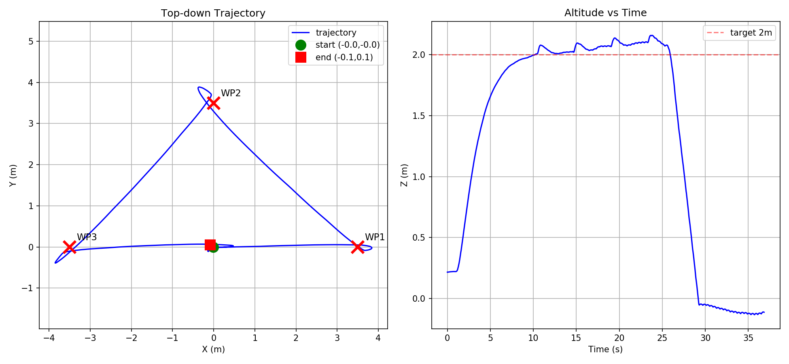

# week3_offboard — PX4 Offboard 控制

> 容器里的 MAVROS 是之前就装好的，PX4 在宿主机上装过但版本太新，Gazebo 成功启动过。先检查环境，然后在容器里重新来一遍。

---

## 环境检查与 PX4 编译

MAVROS 已经在容器内安装过了，确认一下：

```bash
roslaunch mavros px4.launch    # 看能不能正常启
```

Gazebo 直接用 apt 装很快：

```bash
sudo apt install gazebo9 libgazebo9-dev
```

然后是 PX4。宿主机上的版本太新，容器里重新下载源码编译。这里有个问题——我的 workspace 只是容器的普通文件夹映射，不是镜像的一部分，容器销毁 PX4 源码就没了。目前不想创建镜像，先这么下去，注意别手滑删容器就行。

```bash
cd /workspace
git clone --depth=1 https://github.com/PX4/PX4-Autopilot.git
cd PX4-Autopilot
```

下载编译依赖的时候，pip 报了版本太旧的错——容器里的 pip 是上古版本，升级一下：

```bash
pip install --upgrade pip
```

然后按 PX4 官方脚本装依赖：

```bash
bash Tools/setup/ubuntu.sh
```

编译。我是浅克隆只拉了最新代码，没有完整 git 历史，`make` 的时候遇到 tag 问题——PX4 的构建系统想用 `git describe` 拿版本 tag，浅克隆拿不到。反正只是跑仿真不是实机部署，直接设个虚拟 tag：

```bash
git tag v1.14.0-dev
make px4_sitl gazebo
```

编译完 Gazebo 窗口跳出来了。试一下：

```bash
commander takeoff
commander land
```

能起飞能降落，PX4 + Gazebo + MAVROS 三件套通了。

---

## 创建功能包

ROS1 不是 ROS2，工作空间叫 catkin_ws，编译工具是 catkin_make 不是 colcon。注意区别。

```bash
cd /workspace/catkin_ws/src
catkin_create_pkg week3_offboard rospy roscpp geometry_msgs mavros_msgs std_msgs

cd /workspace/catkin_ws/src/week3_offboard
mkdir -p launch scripts

cd /workspace/catkin_ws
catkin build 2>/dev/null || catkin_make

echo "source /workspace/catkin_ws/devel/setup.bash" >> ~/.bashrc
source ~/.bashrc
```

### 依赖说明

| 依赖 | 干嘛的 |
|------|--------|
| `rospy` | ROS Python 库，节点/话题/服务全靠它 |
| `roscpp` | C++ 库，保留兼容，实际上全用的 Python |
| `geometry_msgs` | `PoseStamped` 位姿消息 |
| `mavros_msgs` | `State` 飞控状态消息，`CommandBool` 和 `SetMode` 两个服务 |
| `std_msgs` | 标准消息，虽然这次没直接用但留着不碍事 |

### 文件结构

```
week3_offboard/
├── CMakeLists.txt
├── package.xml
├── README.md
├── launch/
│   └── offboard.launch
└── scripts/
    ├── offboard_node.py
    ├── learn_ROS_topic_src.py
    └── learn_py_OOP.py
```

---

## 节点架构

```
┌─────────────────┐               ┌──────────┐    MAVLink    ┌──────┐
│  offboard_node  │ ←── 订阅 ──── │  MAVROS  │ ←──────────→ │ PX4  │
│                 │               │          │              │      │
│  state_cb  ←───┼── /mavros/state                         飞控  │
│  pose_cb   ←───┼── /mavros/local_position/pose                │
│  pose_pub  ────┼→  /mavros/setpoint_position/local            │
│  arming    ────┼→  /mavros/cmd/arming                         │
│  set_mode  ────┼→  /mavros/set_mode                           │
└─────────────────┘               └──────────┘              └──────┘
```

用到的消息和服务长这样：

```
PoseStamped (geometry_msgs)              State (mavros_msgs)
header.stamp   ← rospy.Time.now()        connected   ← 飞控连上了吗
header.frame_id                          armed       ← 解锁了吗
pose.position  (x, y, z)                 mode        ← 当前模式 (OFFBOARD?)
pose.orientation

CommandBool:  request value=True  → response success
SetMode:      request custom_mode="OFFBOARD" → response mode_sent
```

---

## 关键 API 速查

| API | 一句话 |
|-----|--------|
| `rospy.init_node('offboard_node')` | 初始化节点 |
| `rospy.Subscriber(topic, Type, cb)` | 订阅，收到消息自动回调 |
| `rospy.Publisher(topic, Type, qsize)` | 声明发布器 |
| `rospy.ServiceProxy(srv, Type)` | 创建服务客户端（同步阻塞） |
| `rospy.Rate(20)` | 定频 20Hz |
| `rate.sleep()` | 自动补时到 20Hz |
| `rospy.Time.now()` | 当前时间戳 |
| `rospy.Duration(N)` | N 秒时长 |
| `rospy.is_shutdown()` | 节点被关了？ |

---

## 控制流程

```
发 100 次 setpoint 预热
       ↓
切 OFFBOARD 模式（失败重试，保持发 setpoint）
       ↓
解锁 arm
       ↓
起飞 2m → 悬停 5s → 正方形 4 点 → 回到起点
       ↓
AUTO.LAND 降落
```

核心原则就一条：**任何时候都不要停 setpoint 流**。PX4 在 OFFBOARD 模式下 500ms 收不到消息就自动脱出模式，所以等连接要发、重试要发、飞航线要发、降落也要发。

---

## 航线

```
(0,2,2) ←── (2,2,2)
   │            │
   │  悬停 5s   │
   │            │
(0,0,2) ──→ (2,0,2)
   ↑
 起飞 2m
```

到达判断：`dist_to(target) < 0.3m`，进了 0.3m 半径算到达。需要悬停的地方，记下 `arrive_time`，用 `(rospy.Time.now() - arrive_time).to_sec()` 掐表。

---

## 踩坑记录

### 坑1：roslaunch 找不到 px4

报错 `[px4] is not a package`。

**原因：** `~/.bashrc` 里 `source` 的顺序不对——先 source 了 catkin_ws 的 setup.bash，再 source PX4 的，ROS 的包路径被覆盖了。

**解决：** 把 PX4 的 source 放在 catkin_ws 前面：

```bash
# ~/.bashrc 顺序
source /workspace/PX4-Autopilot/Tools/simulation/gazebo-classic/setup_gazebo.bash ...
source /workspace/catkin_ws/devel/setup.bash
```

### 坑2：arm 被拒 — tone_alarm negative ★

这是整个实验踩的最大的坑。现象：切 OFFBOARD 成功了，但接下来的 `arming_client(True)` 一直返回 `success=False`，终端里能看到 `tone_alarm negative` 的警告音。

**折腾过程：** 一开始以为是模式没切好，加了重试；然后又怀疑是解锁时机不对，调了延迟；最后看了 PX4 的 commander 源码才发现根因——

**根因：** arm 重试期间，setpoint 流断了。我的初版写法是在 arm 重试循环里没有 `pose_pub.publish()`——因为当时觉得"反正位置没变，多发也没用"。但 PX4 的解锁前置检查要求 **OFFBOARD 模式下 setpoint 消息的间隔不超过 500ms**。一旦超过，PX4 内部把这条 setpoint 标记为"过期"，拒绝 arm。

**修法：** 把"切模式 + arm"的逻辑从顺序执行改成 **边发边切** 的循环——arm 重试的每一帧都先 `pose_pub.publish(target)`，再调 `arming_client`。这也是 PX4 官方 offboard 例程的写法。

```python
# ❌ 初版：arm 重试时 setpoint 断了
while not armed:
    arming_client(True)    # 重试期间没发 setpoint → PX4 拒绝
    rate.sleep()

# ✅ 改后：重试时每一帧都维持 setpoint
while not armed:
    target.header.stamp = rospy.Time.now()
    pose_pub.publish(target)     # 先维持心跳
    if (rospy.Time.now() - last).to_sec() > 5.0:
        arming_client(True)      # 再调 arm
    rate.sleep()
```

这个坑是 PX4 Offboard 开发最经典的坑，写进报告很加分。

---

## 异常处理

| 异常 | 怎么检测 | 怎么处理 |
|------|----------|----------|
| FCU 没连接 | `current_state.connected == False` | 等 30s，超时退出，绝不 arm |
| OFFBOARD 切不过去 | `resp.mode_sent == False` | 最多重试 5 次，间隔继续发 setpoint |
| 位置误差 > 2m | `dist_to(target) > 2.0` | 2s 节流警告，原地悬停等收敛 |
| Ctrl+C | `ROSInterruptException` | 尝试切 AUTO.LAND 保命 |

---

## 运行方式

```bash
# 一键
roslaunch week3_offboard offboard.launch

# 或者分步
roslaunch px4 mavros_posix_sitl.launch &
rosrun week3_offboard offboard_node.py
```

成功起飞，完成正方形航线，降落。

---

## 任务2：自定义世界 + 巡视航线

### 搭建自定义世界

PX4 官方有空白世界的模板，直接拷贝一份改：

```bash
cd /workspace/catkin_ws/src/week3_offboard
mkdir -p worlds bags launch
cp /workspace/PX4-Autopilot/Tools/simulation/gazebo-classic/sitl_gazebo-classic/worlds/empty.world \
   worlds/my_arena.world
```

然后在里面手写障碍物——三个地标（红柱子、绿箱子、蓝高塔）+ 一个小黄球。详细的世界搭建笔记见语雀：https://www.yuque.com/gongbutangjuan-c3v0z/lkf0qn/emcgixtr8nbfq6gh

### 创建巡视节点

代码主体直接复用任务1的 offboard_node，改动不大：

```bash
cd /workspace/catkin_ws/src/week3_offboard/scripts
cp offboard_node.py survey_node.py
chmod +x survey_node.py
```

相比任务1，改了几处：

| 改动 | 说明 |
|------|------|
| 航点列表 | 目标点改成三个地标外侧 (3.5,0)、(0,3.5)、(-3.5,0)，往外让了 0.5m 防止撞柱 |
| 节点名 | `offboard_node` → `survey_node`，防止两个节点重名冲突 |
| 注释 | docstring、日志里的描述都改成巡视相关 |
| 悬停 | 每个巡视点加了 2s 停留，不然一到点误差小于 0.3 立刻飞下一站，很不稳定 |

### 跑起来 + 录 rosbag

```bash
# 终端1：启动仿真 + 巡视节点
roslaunch week3_offboard task2_arena.launch

# 终端2：无人机开始起飞时开始录 bag
# 录三类数据：位置（画轨迹图用）、速度（算运动状态用）、飞控状态
rosbag record \
  /mavros/local_position/pose \
  /mavros/local_position/velocity_body \
  /mavros/state \
  -O ~/bags/survey.bag
```

`rosbag record` 会把这三条话题上的所有消息原封不动存下来，跑完后用 Python + matplotlib 画轨迹图。

### 巡视航线

```
起飞 2m → 悬停 5s → 三个地标外侧各悬停 2s → 返回降落

          绿色箱子 (0, 3.5)
              │
              │
  蓝塔 ←─────┼──────→ 红柱
(-3.5, 0)    │     (3.5, 0)
              │
          起飞点 (0, 0)
```

### 到达误差

阈值 0.3m，比比赛要求的 0.5m 更严格：

```
[INFO] 到达 巡视点1-红柱外侧，实际误差 0.024 m (< 0.5m 达标)
[INFO] 到达 巡视点2-绿箱外侧，实际误差 0.134 m (< 0.5m 达标)
[INFO] 到达 巡视点3-蓝塔外侧，实际误差 0.096 m (< 0.5m 达标)
```

**最大误差 0.134m，远优于 0.5m 要求。**

### 轨迹图分析

跑完 bag 后用 matplotlib 画了 trajectory.png：



暴露三个现象：

#### 1. 巡航高度系统性偏高（+0.15m）

目标高度 2m，实际巡航在 2.0~2.3m 波动。

**原因：** PX4 位置控制器的超调——切航点时有向上的速度惯性，控制器纠偏需要一个过程。这是正常现象。

**改善方向：** 调 `MPC_Z_P`（高度环 P 增益），但会牺牲响应速度。+0.15m 在安全范围内，当前参数足够。

#### 2. WP2（绿箱）附近的小弯钩

轨迹在绿箱巡视点不是干净地到点就拐，而是冲过去一点再兜回来。

**原因：** 0.3m 阈值判到达 → 立刻切下一目标 → 水平惯性让它多冲了 10~20cm 才被控制器拉回来。**WP2 误差 0.134m 不是"没到点"，而是"冲过了点"。**

#### 3. 终点偏差约 0.1m

降落点距原点约 (-0.1, 0.1)。AUTO.LAND 的低空地面效应 + 侧风扰动，10cm 偏差完全正常。

### 任务2 小结

| 指标 | 数值 | 判定 |
|------|------|------|
| 最大到点误差 | 0.134m | < 0.5m ✓ |
| 高度偏差 | +0.15m | 控制器超调，正常 |
| 终点偏移 | ~0.1m | 地面效应，可接受 |
| 全部 3 个巡视点 | 到达 | 航线完整执行 |
